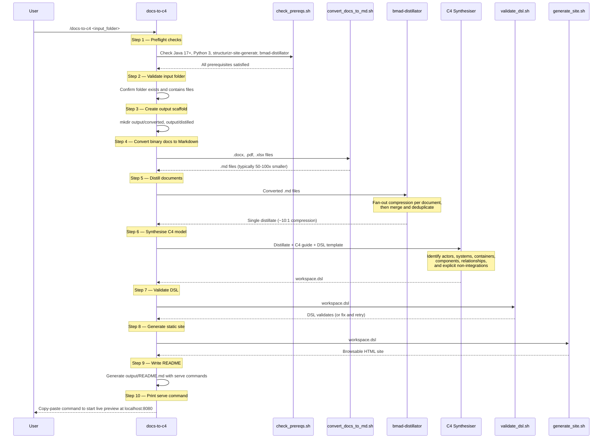

# JI Analysis 

## Claude skill - Docs to C4

### Purpose

This skill automates the creation of [C4 architecture models](https://c4model.com/) from existing documentation. Rather than manually reading through requirements, design specs, and capability documents to draw architecture diagrams by hand, this skill extracts system structure directly from your documents and produces a browsable, interactive C4 model.

The quality of the generated model reflects the quality of the input documentation. Well-structured documents with clear descriptions of systems, integrations, actors, and boundaries will produce rich, detailed models. Sparse or ambiguous documentation will produce simpler models with gaps clearly flagged for follow-up.

### Overview

A Claude Code skill that transforms a folder of mixed-format documents (.docx, .pdf, .xlsx, .md) into a browsable C4 architecture model, powered by [Structurizr](https://structurizr.com/).

Give it a pile of requirements docs, design specs, or capability documents and it produces:

- A **Structurizr DSL workspace** with System Context, Container, and Component views
- A **static browsable site** you can share with your team
- A **live preview server** for interactive exploration

### Supported platform

| Platform | Status |
|----------|--------|
| macOS (Apple Silicon & Intel) | Supported |
| Linux | Not tested |
| Windows | Not tested |

## Prerequisites

The skill requires the following tools on your PATH. Install them all before first use:

```sh
# Java 17+ (required by structurizr-site-generatr)
brew install openjdk@25

# Python 3.10+ (required for document conversion)
brew install python@3

# Structurizr Site Generatr (generates the browsable C4 site)
brew tap avisi-cloud/tools
brew install structurizr-site-generatr

# Claude Code CLI (the skill runs inside Claude Code)
# See https://docs.anthropic.com/en/docs/claude-code/overview
npm install -g @anthropic-ai/claude-code
```

### BMAD plugin

The skill depends on `bmad-distillator` for document compression. Install the [BMAD plugin](https://github.com/bmadcode/BMAD-METHOD) for Claude Code so that the `bmad-distillator` skill is available in your session.

### Verify prerequisites

Run the preflight check script to confirm everything is in place:

```sh
bash .claude/skills/docs-to-c4/scripts/check_prereqs.sh
```

Expected output:

```
OK — prerequisites satisfied.
  java: openjdk version "21.0.9" 2025-10-21
  python3: Python 3.14.0
  structurizr-site-generatr: /opt/homebrew/bin/structurizr-site-generatr
  bmad-distillator: /path/to/.claude/skills/bmad-distillator
```

## Installation

Clone this repository:

```sh
git clone git@github.com:scrumconnect/ji-analysis.git
cd ji-analysis
```

The skill lives at `.claude/skills/docs-to-c4/` and is automatically discovered by Claude Code when you open a session in this project directory.

On first run, the skill creates a Python virtual environment at `.claude/skills/docs-to-c4/scripts/python/.venv/` and installs its Python dependencies (`python-docx`, `pypdf`, `openpyxl`) automatically. No manual pip install required.

## Usage

From within a Claude Code session in this project:

```
/docs-to-c4 /path/to/your/documents
```

Or with an explicit system name:

```
/docs-to-c4 /path/to/your/documents "My System Name"
```

The skill will run end-to-end and place all output inside `<input_folder>/output/`.

## How it works



## Output structure

All generated artefacts are placed inside `<input_folder>/output/`:

```
<input_folder>/
├── ...source documents (untouched)...
└── output/
    ├── converted/           # Binary docs converted to .md
    ├── distilled/           # Compressed distillate for C4 modelling
    ├── workspace.dsl        # Structurizr DSL — the C4 model
    ├── site/                # Static browsable site
    └── README.md            # Regeneration and serve commands
```

Source documents are never modified.

## Viewing the model

After the skill completes, it prints the exact command to start the live preview server. It looks like:

```sh
/path/to/.claude/skills/docs-to-c4/scripts/serve_site.sh /path/to/output/workspace.dsl
```

Open `http://localhost:8080` in your browser. Stop the server with Ctrl+C.

## C4 views generated

| View | What it shows |
|------|---------------|
| **System Context** | The system, its users (by role), external systems it integrates with, and systems it explicitly does *not* integrate with (architectural boundaries) |
| **Container** | Deployable units inside the system (web apps, APIs, databases) with technology labels |
| **Component** | Internal structure of containers where the source docs describe modules, services, or functional areas |

The skill only models what the source documents describe. It does not infer or hallucinate architecture.

## Supported input formats

| Format | How it's handled |
|--------|-----------------|
| `.docx` | Text, headings, and tables extracted via python-docx |
| `.pdf` | Page-by-page text extraction via pypdf |
| `.xlsx` | Sheet-by-sheet table extraction via openpyxl |
| `.md`, `.txt`, `.csv`, `.json`, `.yaml` | Copied as-is |

## Re-running the skill

The skill is idempotent — running it again on the same input folder produces an equivalent model. However, **re-running will overwrite previous output** including `workspace.dsl`, the distillate, converted files, and the generated site. If you have manually edited `workspace.dsl`, back it up before re-running.

The document converter supports a `--skip-existing` flag to avoid re-converting files that already have output, but the skill does not use this by default.

## Skill file structure

```
.claude/skills/docs-to-c4/
├── SKILL.md                            # Skill definition and workflow
├── assets/
│   └── workspace-template.dsl          # Starter DSL template with styles
├── references/
│   ├── c4-model-guide.md               # C4 level primer
│   └── structurizr-dsl-guide.md        # DSL syntax crib sheet
└── scripts/
    ├── check_prereqs.sh                # Preflight check (Java, Python, tools, BMAD)
    ├── convert_docs_to_md.sh           # Shell wrapper for document conversion
    ├── validate_dsl.sh                 # DSL validation via dry-run generation
    ├── generate_site.sh                # Full static site generation
    ├── serve_site.sh                   # Live preview server
    └── python/
        ├── convert_docs_to_md.py       # Python document converter
        └── requirements.txt            # Python dependencies
```

## License

This project is licensed under the MIT License — see the [LICENSE](LICENSE) file for details.
