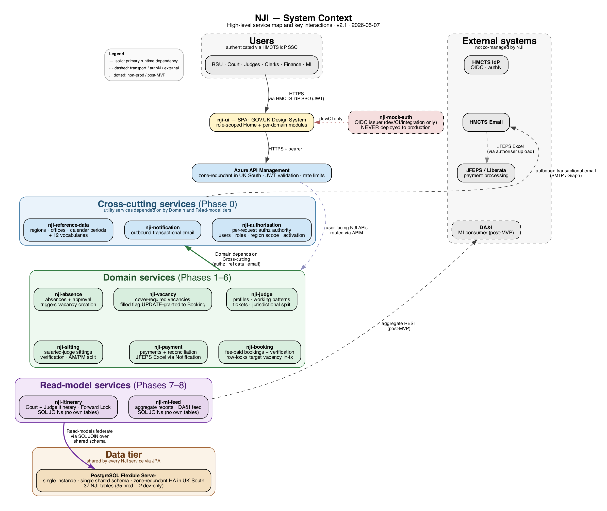

# RAM Pathfinder Architecture Summary

RAM Pathfinder (New Judicial Itineraries) — HMCTS's API-driven greenfield rebuild of the Oracle APEX Judicial Itineraries platform.

This file describes what is built and how it runs. For rationale, alternatives, gap and assumption registers, data-table inventory, conventions, repo structure, changelog, and build sequence, see [`./architecture.md`](./architecture.md) and the siblings under [`./architecture/`](./architecture/).

## System context

## Service decomposition (11 services + UI)

### Domain services

| Service | Responsibility |
|---|---|
| `ram-judge` | Judges, working patterns, tickets, jurisdictional split |
| `ram-absence` | Absence records + approval workflow; triggers vacancy creation |
| `ram-vacancy` | Cover-required vacancies; `filled` flag UPDATE-granted to Booking |
| `ram-booking` | Fee-paid bookings + verification; row-locks target vacancy in-transaction |
| `ram-sitting` | Salaried-judge sittings; verification; AM/PM split |
| `ram-payment` | Payments + reconciliation; JFEPS-shaped Excel schedule via Notification |

### Cross-cutting services

| Service | Responsibility |
|---|---|
| `ram-authorisation` | Per-request authz authority; users, roles, Region/Area scope, activation flags |
| `ram-reference-data` | Regions, offices, calendar periods, 12 vocabularies (read directly via SQL by other services; written via API) |
| `ram-notification` | Outbound transactional email (booking / absence acks; JFEPS schedule emails) |

### Read-model services

| Service | Responsibility |
|---|---|
| `ram-itinerary` | Court + Judge itinerary; Forward Look; SQL JOINs over the shared schema (no own tables) |
| `ram-mi-feed` | Aggregate reports; DA&I consumer feed (post-MVP); SQL JOINs over the shared schema (no own tables); aggregate-only — no case-level data |

### Frontend

| Component | Description |
|---|---|
| `ram-ui` | Single SPA; per-domain modules; GOV.UK Design System; WCAG 2.2 AA; HMCTS IdP SSO |

### Non-production support

| Component | Description |
|---|---|
| `ram-mock-auth` | OIDC issuer for dev / CI / integration environments only — **never deployed to production** |

## Technology stack

| Layer | Choice |
|---|---|
| Language & runtime | Java 25 (LTS) + Spring Boot 4.0.6 |
| Build | Gradle (Groovy DSL); HMCTS Crime SpringBoot template as scaffold |
| Database | PostgreSQL 17 on Azure Database for PostgreSQL Flexible Server (single global instance; single shared schema; zone-redundant HA in UK South) |
| Schema evolution | Flyway (RAM Pathfinder DDL only) |
| Container orchestration | Azure Kubernetes Service — single production cluster in UK South with multi-AZ node pools |
| Ingress | Azure API Management — Premium SKU, zone-redundant |
| Identity provider | HMCTS IdP via OIDC `authorization_code` (production, human users only); `ram-mock-auth` in dev / CI / integration; JWKS endpoint provides JWT-signature public keys to every RAM Pathfinder service |
| Service-to-service auth | **User-initiated**: JWT propagation via `RestClient` interceptor (forward inbound user JWT). **Batch / scheduled** (payment batch only at MVP): OAuth `client_credentials` against `ram-mock-auth`; production issuer per G7.1 (default recommendation: Azure Workload Identity). |
| Per-request auth | Custom `JWTFilter` (HMCTS Crime template pattern, `io.jsonwebtoken:jjwt`) — validates JWT signature against IdP JWKS, then calls `ram-authorisation` for authz |
| Secrets | Azure Key Vault (zone-redundant) |
| Observability | Logback + Logstash JSON encoder → OpenTelemetry → Azure Application Insights / Log Analytics |
| Frontend stack | React + TypeScript + Vite + GOV.UK Design System |
| Static hosting | Azure Static Web Apps |

## Data tier

- One PostgreSQL Flexible Server instance in UK South. One shared schema. Zone-redundant HA (primary + standby in different AZs; synchronous replication; automatic failover <60 s).
- 37 tables: 34 service-owned production + 1 shared infrastructure (`configuration_values`) + 2 dev-only (mock-auth).
- Per-service DB roles (`ram_judge`, `ram_booking`, `ram_payment`, …) with explicit grants. A service has `ALL` on its own tables; only the specific grants it needs on others.
- **Cross-service reads** — direct SQL JOIN using SELECT grants. No caching at MVP.
- **Cross-service simple writes** — direct UPDATE on UPDATE-granted columns within the writer's transaction (e.g. Booking writes `vacancies.filled`).
- **Cross-service workflows** — REST API call to the owning service.
- **Read models** — SQL JOIN over the shared schema. No API fan-out.

Full per-table inventory: [`./architecture/data-tables.md`](./architecture/data-tables.md).

## Authentication & Authorisation

Most runtime requests are user-initiated. The one exception is the payment-processing batch (`ram-payment-batch`), which runs on a schedule and authenticates as a service principal.

The auth flow:

1. User authenticates at HMCTS IdP (SSO). IdP issues a JWT.
2. User calls `ram-ui` with the JWT; UI forwards the bearer token through APIM to the target service.
3. The service's `JWTFilter` validates the JWT against HMCTS IdP's JWKS, then calls `ram-authorisation` for authz scope.
4. Cross-service calls forward the user's JWT — the upstream service copies the inbound `Authorization` header onto outbound calls. The downstream `JWTFilter` validates the same JWT.

Details:

- **End-user authentication** — HMCTS IdP, OIDC `authorization_code`. SSO. JWT issued. `ram-mock-auth` (Spring Authorization Server) is the OIDC issuer in non-production. Mock-to-real cutover is a Spring profile change (issuer-url + JWKS URL flip; no code change).
- **JWT signature validation** — each service's `JWTFilter` (HMCTS Crime template, `io.jsonwebtoken:jjwt`) validates signature and issuer using the IdP's JWKS endpoint (`/oauth2/jwks` on mock; HMCTS IdP's JWKS URL in production). Validation runs before any controller. Public keys cached per the issuer's cache headers.
- **End-user authorisation** — after JWT validation, `JWTFilter` calls `POST /authz/check` against `ram-authorisation` for role + Region/Area scope + activation flag (FR58). Result stored in a request-scoped `AuthDetails` bean.
- **JWT propagation (user-initiated cross-service calls)** — the `RestClient` interceptor copies the inbound `Authorization: Bearer <user-jwt>` header onto outbound calls. The downstream `JWTFilter` validates the same JWT.
- **Service-principal auth (batch)** — the payment batch authenticates against `ram-mock-auth` (non-prod) via OAuth `client_credentials`, then attaches the service JWT to outbound calls (e.g. Notification). Production issuer is deferred (default: Azure Workload Identity — `architecture/gaps.md` G7.1).
- **APEX ⇄ IdP reconciliation** — email primary, employee number fallback. Performed by Phase 0 dev/CI scripts and the production ETL.

**MVP non-user-initiated flows:**

- Payment batch (`ram-payment-batch`) — scheduled (e.g. weekly), authenticates as a service principal, picks up confirmed bookings/sittings without payment records, generates the JFEPS Excel, dispatches via Notification → HMCTS Email → Payment Authoriser. Sequence: [`./architecture/sequence-diagrams/payment-batch-flow.md`](./architecture/sequence-diagrams/payment-batch-flow.md).

**Out of scope at MVP:**

- Other non-user-initiated flows (more scheduled jobs, async messaging, event bus) — would use the same service-principal pattern.
- DA&I post-MVP MI Feed integration — auth model TBD. See [`./architecture/gaps.md` G7.2](./architecture/gaps.md).
- Production data migration via operator-initiated ETL — works at MVP; flagged for post-MVP refinement. See [`./architecture/gaps.md` G4.7](./architecture/gaps.md).
- Production service-auth issuer — `ram-mock-auth` covers Phase 0–8; deferred per G7.1.

## API patterns

| Pattern | Detail |
|---|---|
| Coordination | REST-first synchronous; no domain event stream, no message bus, no webhook fabric |
| Versioning | URI prefix major version (`/v1/…`); 6-month internal / 12-month external deprecation windows; `Deprecation` header per [RFC 9745](https://datatracker.ietf.org/doc/html/rfc9745); `Sunset` header per [RFC 8594](https://datatracker.ietf.org/doc/html/rfc8594) |
| Error envelope | [RFC 9457](https://datatracker.ietf.org/doc/html/rfc9457) `application/problem+json` (obsoletes RFC 7807; same content type and field shape) |
| OpenAPI | Generated via Swagger Core; published per-service as Maven artefacts (`uk.gov.hmcts.ram:api-ram-{service}:{version}`). The OpenAPI document is the API's contract surface. |
| Pagination | Cursor-based for large or chronological lists; offset-based for small filtered lists |
| Field naming | JSON fields `camelCase`; ISO 8601 dates / instants; UTC stored, UK local for display |
| Identifiers | UUID primary keys throughout |
| Idempotency / retry safety | Native DB primitives — natural-key uniqueness (→ `409 Conflict`), optimistic locking (→ `412 Precondition Failed`), pessimistic row locking for cross-row workflows. No custom idempotency-key tables. Detail in [`./architecture/data-tables.md`](./architecture/data-tables.md) and the Data Architecture section of [`./architecture.md`](./architecture.md). |

## Cross-service interaction patterns

| Pattern | Mechanism |
|---|---|
| User authentication | User → HMCTS IdP (SSO) → JWT issued |
| User request | User (with JWT) → `ram-ui` → APIM (rate limits, routing) → service |
| Per-request JWT validation | Each RAM Pathfinder service's `JWTFilter` validates the inbound JWT signature against **HMCTS IdP's JWKS endpoint** before any controller is invoked |
| Cross-service call (within a user request) | Upstream service's outbound `RestClient` interceptor copies the inbound `Authorization: Bearer <user-jwt>` header to the downstream call; downstream service's `JWTFilter` validates the same user JWT (token propagation / forwarding pattern). No separate service identity. |
| Batch / scheduled flow (no user context) | Batch component (e.g. `ram-payment-batch`) authenticates as a service principal via OAuth `client_credentials` against the OIDC issuer (`ram-mock-auth` non-prod); attaches the resulting service JWT to outbound calls (Notification, etc.); receiving services validate via the same JWKS path. **MVP scope: payment batch only.** |
| Per-request authz | After JWT validation, the same `JWTFilter` calls `POST /authz/check` against `ram-authorisation` |
| Reference Data reads | Direct SQL (per-service `SELECT` grant); no API call |
| Reference Data writes | Via `ram-reference-data` API (admin / Phase 0 seeding) |
| Cross-service workflow | REST call to the owning service |
| Cross-row workflow safety | Pessimistic row lock on the related row + natural-key uniqueness on the new row (detail in *Data Architecture*) |
| Read-model federation | SQL JOIN over the shared schema (no API fan-out) |
| Outbound email | Domain service → `ram-notification` → HMCTS Email → recipient (or, for Payment, → JFEPS via authoriser upload) |
| Configuration | Per-service: Spring profiles + `application.yml` + Azure Key Vault. Cross-service policy values: shared `configuration_values` infrastructure table (read-only via direct SQL; no API). |

## Deployment topology

- **Production region** — Azure UK South.
- **HA** — multi-AZ within UK South for every component:
  - AKS node pools span all three UK South AZs with pod anti-affinity (zone topology spread).
  - PostgreSQL Flexible Server zone-redundant HA (synchronous replication; automatic failover).
  - APIM Premium, Key Vault, Azure Container Registry — all zone-redundant.
- **DR** — open gap; scope and design held in [`./architecture/gaps.md` G3.6](./architecture/gaps.md).
- **Per-service unit** — independently-deployable Spring Boot service; per-service Helm chart with per-environment values files (`values-dev.yaml`, `values-staging.yaml`, `values-production.yaml`).
- **CI/CD** — per-service pipeline (Azure DevOps Pipelines or GitHub Actions). Build → Docker image → Azure Container Registry → Helm upgrade to AKS.
- **Logging** — structured JSON logs (Logstash encoder) with correlation IDs; OpenTelemetry export to Application Insights; 30 days hot in App Insights + 90 days cold in Log Analytics archive.

## Phased rollout

- **Boundary** — per HMCTS judicial region (Northern, Western, etc.), with all applicable user roles in that region migrating together.
- **Mechanism** — per-user activation flag in `auth_user_activation_flags` (FR58). Migrated regions' users authenticate; non-migrated regions' users are rejected at the `JWTFilter` boundary. Flag flip activates a region; flag flip-off rolls back.
- **Wave gates** — automated tests passing (unit, integration with Testcontainers PostgreSQL, contract); manual UAT signed off by APEX-experienced users; per-region migration verified; programme sign-off.
- **Build sequence** — Phase 0 cross-cutting services + UI shell + Phase 0 Data Migration ETL; Phases 1–6 domain services in dependency order (Judge → Absence → Vacancy → Booking → Sitting → Payment); Phases 7–8 read-models (Itinerary, MI Feed); Pre-Phase-9 real-IdP cutover; Phase 9+ per-region rollout waves.

## Phase 0 Data Migration ETL

A programme deliverable, not a runtime service:

- Lives at `ram-architecture/migration/`.
- Reads APEX SQL dumps; transforms rows to RAM Pathfinder shape; loads via the Reference Data API and Authorisation API.
- Migrates Reference Data and active user records + role/Region-Area scope mappings. No transactional data.
- Re-runs per rollout wave for incremental user activation.
- APEX is the source. RAM Pathfinder's schema is set by RAM Pathfinder design.

## External integrations

| System | Direction | Purpose |
|---|---|---|
| HMCTS IdP | inbound (human authN only) + JWKS used by RAM Pathfinder services for JWT signature validation | OIDC `authorization_code` flow for human users; every RAM Pathfinder service's `JWTFilter` validates inbound user JWTs against IdP JWKS before allowing access to RAM Pathfinder APIs. **Service-principal token issuance** for the payment batch is handled by `ram-mock-auth` in non-prod; production decision per G7.1. |
| HMCTS Email | outbound | Booking / absence acknowledgements; JFEPS payment schedules |
| JFEPS / Liberata | outbound (via authoriser email upload) | Payment processing |
| DA&I | inbound (post-MVP REST) | MI consumer for aggregate reports |
| APEX (legacy) | inbound (read-only) | 12-month historical-data bridge for migrated users in each region post-cutover |

## Foundational principles

1. **API for workflows; shared database for simple data access.** Multi-step operations with business rules and state transitions are exposed as APIs by the owning service. Single-field cross-service updates (where DB grants permit) and read-model federation (SQL JOINs over the shared schema) bypass the API. No shared runtime library; each service owns its cross-cutting concerns.
2. **No premature optimisation.** Caching, distributed cache, service mesh, read replicas, async messaging — added only when measurement post-MVP shows the need. Use native platform constructs (DB locking, optimistic concurrency, uniqueness constraints, Spring profiles + Key Vault) before custom entities.

## Where to find more detail

| Topic | Location |
|---|---|
| Decision history, alternatives, validation | [`./architecture.md`](./architecture.md) |
| Conventions — naming, structure, format, communication, process, enforcement | [`./architecture/conventions.md`](./architecture/conventions.md) |
| Repo directory trees, local dev workflow, deployment pipeline | [`./architecture/repo-structure.md`](./architecture/repo-structure.md) |
| Table ownership mapping | [`./architecture/data-tables.md`](./architecture/data-tables.md) |
| HMCTS Crime SpringBoot starter, dependencies, RAM Pathfinder overlay | [`./architecture/starter-template.md`](./architecture/starter-template.md) |
| Gaps (G1–G7) | [`./architecture/gaps.md`](./architecture/gaps.md) |
| Assumptions (A1–A35) | [`./architecture/assumptions.md`](./architecture/assumptions.md) |
| Changelog | [`./architecture/changelog.md`](./architecture/changelog.md) |
| PRD | [`./prd.md`](./prd.md) |
