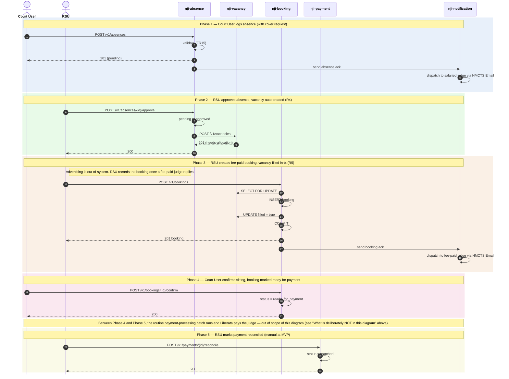

# Absence → Vacancy → Booking → Sitting → Reconciliation

High-level sequence diagram of the **user-initiated** activities in the canonical NJI operational cycle: a Court User logs an absence on behalf of a salaried judge, the absence triggers a vacancy, RSU fills the vacancy with a fee-paid booking, the Court User confirms the sitting (marking it *ready for payment*), and finally RSU reconciles the payment after the downstream batch + external systems have completed.

The flow is split into **five phases** — each one driven by a user action. Phases are colour-tinted in the diagram for visual separation.

## What is deliberately NOT in this diagram

The MVP assumption (architecture v2.5 — A35) is that the diagrammed runtime flow contains only user-initiated activities. The following sit between Phase 4 and Phase 5 but are **not** drawn here because they are not user-initiated runtime calls:

- **Routine payment-processing batch** — picks up bookings whose `status = ready_for_payment`, SQL-JOINs across confirmed bookings + sittings, generates the JFEPS-shaped Excel schedule, persists `payments` + `payment_schedules`, and dispatches the schedule by email to the Payment Authoriser. Runs on a schedule (e.g. end-of-week), not in response to any user click.
- **Payment Authoriser → JFEPS / Liberata** — the authoriser reviews the emailed schedule and uploads it to Liberata using the existing JFEPS workflow. Out-of-band; NJI is not in the loop.
- **Liberata processing** — Liberata pays the fee-paid judge into their payroll account. External system; not part of NJI runtime.

The architectural rules and integration points for these batch / external steps are described in `architecture.md` (Step 4 *Data Architecture*, Step 6 *Integration Points — External*).

## Cross-cutting steps omitted for clarity

These apply on every Court / RSU → service call but would clutter the diagram:

- All UI→service calls flow through Azure API Management.
- Each service's `JWTFilter` validates the inbound JWT signature against HMCTS IdP's JWKS endpoint **before** the controller runs.
- The same `JWTFilter` calls `POST /authz/check` against `nji-authorisation` to resolve role + Region/Area scope + per-region activation flag (FR58).
- Cross-service calls forward the user's JWT (token propagation; no service principals at MVP).

## Phase summary

| Phase | Driver | Architectural rule | Outcome |
|---|---|---|---|
| 1 — Absence logged | Court User | Validation (FR15-style: ticket-type + start date required) | Absence record created (status: pending); ack email to salaried judge |
| 2 — Absence approved | RSU | **R4** — approval triggers vacancy creation | Vacancy created (status: needs-allocation) |
| 3 — Booking created | RSU | **R5** — pessimistic row lock + in-transaction UPDATE on `vacancies.filled` | Booking persisted; vacancy filled; ack email to fee-paid judge |
| 4 — Sitting confirmed | Court User | State transition; record marked ready for the payment batch | Booking status = `ready_for_payment` (the batch picks this up later) |
| *(out of scope)* | *(none — batch / external)* | *Routine payment-processing batch + Liberata processing* | *JFEPS Excel generated, dispatched, uploaded; judge paid* |
| 5 — Reconciliation | RSU | Manual at MVP (automated reconciliation feed from Liberata is post-MVP) | `payment_reconciliations.status = matched` |

## Where to find more detail

| Detail | Location |
|---|---|
| Service responsibilities and key functions | [`../../architecture.md` → Repository List](../../architecture.md) |
| Data Architecture (shared schema, per-service DB roles, R5 pessimistic-lock pattern) | [`../../architecture.md` → Step 4 *Data Architecture*](../../architecture.md) |
| Integration Points — internal call patterns + external systems (HMCTS Email, JFEPS / Liberata) | [`../../architecture.md` → Step 6 *Integration Points*](../../architecture.md) |
| Authentication / authorisation cross-cutting steps (omitted from diagram) | [`../../architecture.md` → Step 4 *Authentication & Security*](../../architecture.md), [`../../architecture-summary.md` → *Authentication & Authorisation*](../../architecture-summary.md) |
| Per-table column-level detail (`bookings`, `vacancies`, `payments`, `payment_schedules`, `payment_reconciliations`, `notification_dispatches`, `auth_users`) | [`../data-tables.md`](../data-tables.md) |
| Reconciliation lifecycle (MVP manual; post-MVP roadmap) | [`../../architecture.md` → Step 4 *Data Flow — Canonical Operational Cycle*](../../architecture.md); PRD `FR46` |
| Retry-safety conventions (`@Version` optimistic locking, natural-key unique constraints, `SELECT … FOR UPDATE`) | [`../conventions.md` → *Retry safety and concurrency control*](../conventions.md) |
| JWT propagation pattern (the cross-cutting auth step omitted from the diagram) | [`../conventions.md` → *Communication Patterns / JWT propagation*](../conventions.md) |
| Service-identity question for non-user-initiated flows (which the payment batch is) | [`../gaps.md` → G7](../gaps.md) — explicitly post-MVP open item |
