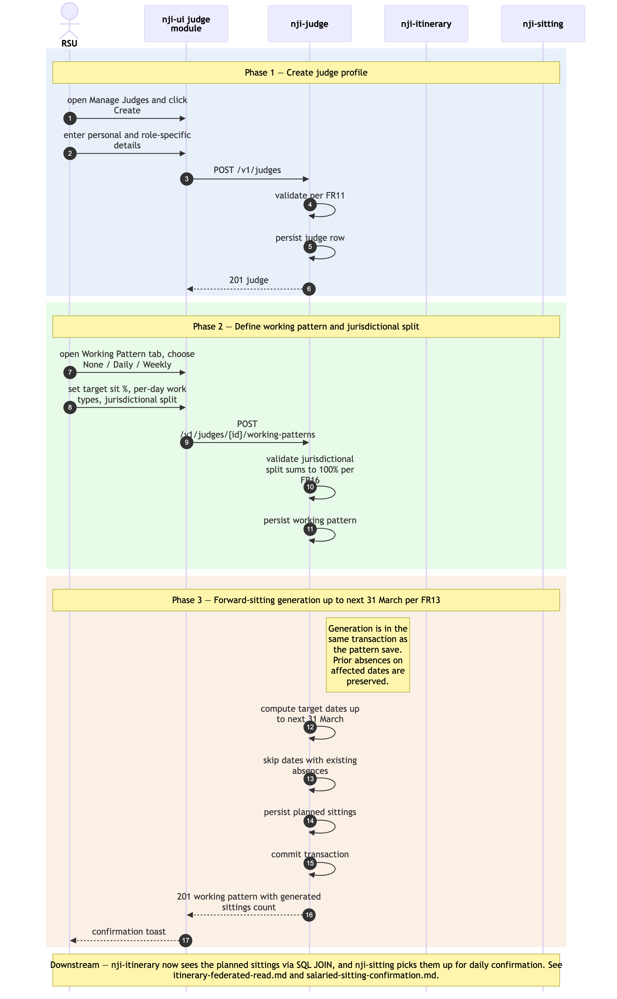

# Judge onboarding + working-pattern-driven sitting generation

Sequence diagram of how a new judge is onboarded into RAM Pathfinder and how that judge's working pattern automatically populates planned sittings up to the next 31 March. This is the upstream of every downstream operational flow — absences, vacancies, bookings, sittings, payments, itineraries all depend on the judge records and planned sittings produced here.

The as-is equivalent is Module 2 *Manage Judges* in [`../../../docs/architecture/asis/functional-modules.md`](../../../../docs/architecture/asis/functional-modules.md) and Integration Flow 1 *Judge Master Data (eLinks / HR → JI)* in [`../../../docs/architecture/asis/integration-dependencies.md`](../../../../docs/architecture/asis/integration-dependencies.md). In the as-is system the data is copied in manually from eLinks and HR records and JI auto-overwrites future sittings on pattern save. RAM Pathfinder keeps the same business behaviour but with explicit API contracts and DB-level constraints.

Three phases: (1) judge profile create; (2) working pattern + jurisdictional split; (3) forward-sitting generation up to next 31 March.

## Not in this diagram

- **eLinks / HR system integration** — neither in as-is nor in RAM Pathfinder MVP (NFR24 / Risk #1 in PRD). Judge data continues to be entered manually by RSU.
- **Cross-Region base-location change** (FR17) — out-of-system; requires OPT Advice Point in the as-is and a programme decision in RAM Pathfinder.
- **Off-circuit / cross-Region judge linking for bookings** (FR18) — handled as a read-only link in [`./itinerary-federated-read.md`](./itinerary-federated-read.md), not in this flow.
- **Editing an existing working pattern** — same shape as Phase 2 + Phase 3 but with prior-absence preservation logic; not drawn separately to keep the diagram lean. The architectural rule (preserve prior absences when regenerating sittings, FR13) is the same.
- **Ticket maintenance** (FR15) — a small follow-up CRUD operation; same shape as Phase 1.

## Cross-cutting steps omitted for clarity

- **Authentication + per-request authorisation** — Sys Admin / RSU's JWT is validated by each service's `JWTFilter` and resolved against `ram-authorisation` on every call. See [`./user-authentication-and-authorisation.md`](./user-authentication-and-authorisation.md).
- All UI → service calls flow through Azure API Management.
- Validation errors at any step return RFC 9457 problem-details and the user retries; not drawn explicitly.

*Source: [`./judge-onboarding-and-sitting-generation.mmd`](./judge-onboarding-and-sitting-generation.mmd) (Mermaid). Regenerate with `mmdc -i judge-onboarding-and-sitting-generation.mmd -o judge-onboarding-and-sitting-generation.png -w 2400 -s 2 --backgroundColor white`.*

## Phase summary

| Phase | Driver | Architectural rule | Outcome |
|---|---|---|---|
| 1 — Judge profile create | RSU (Full Access) | FR11 — judge profile fields validated; role-specific data captured | Judge persisted in `judges` table; active/inactive status set |
| 2 — Working pattern + jurisdictional split | RSU | FR12 + FR16 — pattern type (None / Daily / Weekly), target sit %, per-day work types; jurisdictional split percentages must total exactly 100% | Working pattern persisted in `working_patterns` table linked to the judge |
| 3 — Forward-sitting generation | `ram-judge` (server-side, in-transaction with pattern save) | FR13 — auto-populate planned sittings up to the next 31 March, preserving any prior absences on the affected dates | `sittings` rows in `planned` status for the judge over the generation horizon; visible to `ram-sitting` for confirmation flows and to `ram-itinerary` for read federation |

## Where to find more detail

| Detail | Location |
|---|---|
| `ram-judge` repo purpose and key functions | [`../repository-strategy.md`](../repository-strategy.md) Phase 1 row |
| Working-pattern semantics (None / Daily / Weekly; target sit %; jurisdictional split) | PRD `FR12`, `FR13`, `FR16`; Module 2 in [`../../../docs/architecture/asis/functional-modules.md`](../../../../docs/architecture/asis/functional-modules.md) |
| `judges`, `working_patterns`, `sittings` tables (column-level detail) | [`../data-tables.md`](../data-tables.md) |
| Judge UI module structure | [`../repo-structure.md` → `ram-ui/src/modules/judge/`](../repo-structure.md) |
| Why this flow is in `ram-ui` and not `ram-admin-ui` (RSU operational vs admin) | [`../../architecture.md` → Step 4 *Frontend Architecture*](../../architecture.md) — v2.10 |
| Downstream consumers — Itinerary read federation | [`./itinerary-federated-read.md`](./itinerary-federated-read.md) |
| Downstream consumers — Sitting confirmation flow | [`./salaried-sitting-confirmation.md`](./salaried-sitting-confirmation.md) |
| As-is equivalent (Module 2 Manage Judges; manual eLinks/HR entry) | [`../../../docs/architecture/asis/functional-modules.md` → Module 2](../../../../docs/architecture/asis/functional-modules.md); [`../../../docs/architecture/asis/integration-dependencies.md` → Flow 1](../../../../docs/architecture/asis/integration-dependencies.md) |
