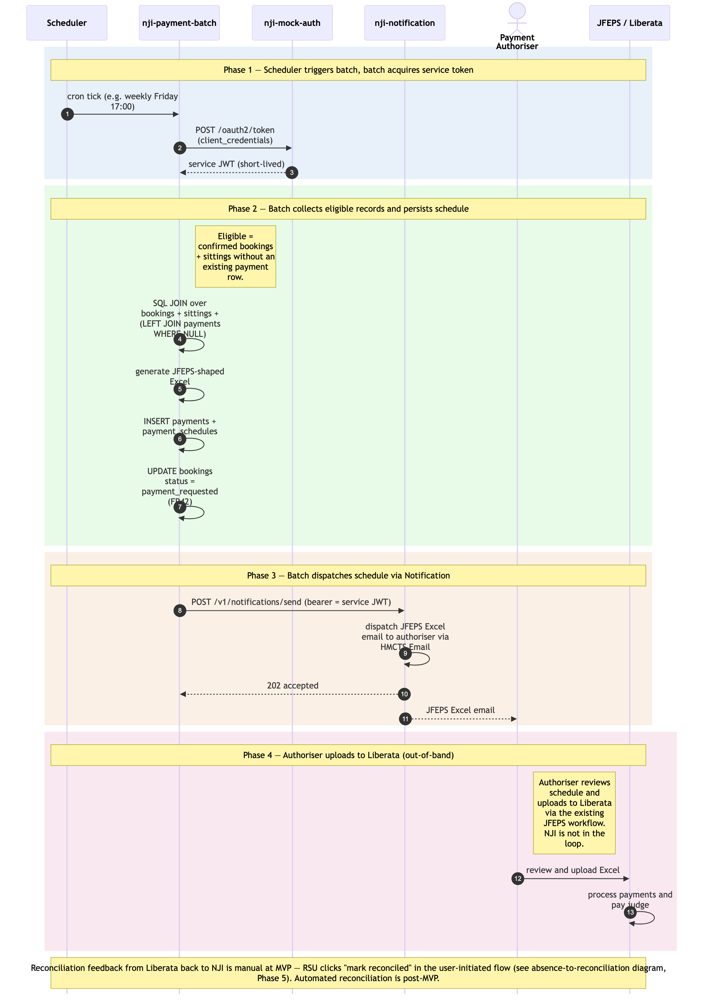

# Payment-batch flow

High-level sequence diagram of the **scheduled, non-user-initiated** half of the operational cycle: a scheduler triggers the payment-processing batch, which authenticates as a service principal, picks up the bookings/sittings that are confirmed but not yet paid, generates the JFEPS-compatible Excel schedule, and dispatches it via Notification → HMCTS Email to the Payment Authoriser. The authoriser then uploads to Liberata out-of-band, and Liberata pays the judge.

This is the companion to [`./absence-to-reconciliation.md`](./absence-to-reconciliation.md), which covers the user-initiated activities. Together they describe the end-to-end operational cycle: the user-initiated flow ends with a booking marked as confirmed and ready for payment; the batch flow below picks up that record on its next scheduled run.

The flow is split into **four phases** — phase 1 is in-process automation (scheduler + batch authentication); phases 2–3 are the batch's actual work; phase 4 is out-of-band external processing (Liberata). Phases are colour-tinted in the diagram for visual separation.

## What is and isn't in this diagram

**Included** (the batch's runtime activity):

- Scheduler trigger (Kubernetes CronJob, or Spring `@Scheduled` annotation — implementation choice deferred).
- Batch acquiring its service-principal token via OAuth `client_credentials` against `nji-mock-auth` (non-prod) — production issuer per [`../gaps.md` G7.1](../gaps.md), default recommendation Azure Workload Identity.
- Batch SQL-JOIN read across the shared schema for eligible records.
- Batch persisting `payments` + `payment_schedules` and marking the related bookings as *payment requested*.
- Batch calling the Notification API (with bearer service token) to dispatch the JFEPS Excel email.
- Authoriser → Liberata upload as the bridge between NJI and the external payment system (out-of-band but architecturally relevant).
- Liberata processing the payment.

**Not included** (explicitly out of scope of this diagram):

- User-initiated activities (logging absences, approving them, creating bookings, confirming sittings, marking payments reconciled) — those are in [`./absence-to-reconciliation.md`](./absence-to-reconciliation.md).
- Reconciliation feedback from Liberata back into NJI — at MVP this is a manual RSU action (see the user-initiated diagram, Phase 5). Automated reconciliation feed from Liberata is post-MVP.
- The mock-auth's internal token-issuing logic (signing, JWKS, etc.) — covered by the architecture's Authentication & Security section and the auth/JWKS sequences in `architecture.md`.

## Cross-cutting steps omitted for clarity

- The Notification API call from the batch to `nji-notification` flows through Azure API Management (same path as user-initiated calls).
- Notification's `JWTFilter` validates the batch's service-principal JWT against the issuer's JWKS — same mechanism as for human user JWTs.
- Notification calls `nji-authorisation` `POST /authz/check` to resolve the service principal's permissions (service principals have records in `auth_users` with a kind flag distinguishing them from humans).

*Source: [`./payment-batch-flow.mmd`](./payment-batch-flow.mmd) (Mermaid). Regenerate with `mmdc -i payment-batch-flow.mmd -o payment-batch-flow.png -w 2400 -s 2 --backgroundColor white`.*

## Phase summary

| Phase | Driver | Architectural rule | Outcome |
|---|---|---|---|
| 1 — Scheduler triggers batch + token acquisition | Scheduler (cron) | Batch authenticates as service principal via OAuth `client_credentials` | Batch holds a short-lived service JWT for its run |
| 2 — Eligible records collected + schedule persisted | Batch (no user) | SQL JOIN over confirmed bookings + sittings without payments; FR41–FR45 retry safety via natural-key unique constraints + `@Version` | `payments` + `payment_schedules` rows created; bookings flagged `payment_requested` |
| 3 — Schedule dispatched | Batch (no user) | Service-token bearer on Notification API call; Notification `JWTFilter` validates same as user JWTs (via JWKS) | JFEPS Excel email delivered to Payment Authoriser |
| 4 — Liberata processing | Payment Authoriser → JFEPS | Out-of-band; NJI is not in the loop | Judge paid; awaiting reconciliation (which is user-initiated — see other diagram) |

## Where to find more detail

| Detail | Location |
|---|---|
| User-initiated activities — absence to reconciliation | [`./absence-to-reconciliation.md`](./absence-to-reconciliation.md) |
| Service-principal auth model + production issuer options | [`../../architecture.md` → Step 4 *Authentication & Security*](../../architecture.md); [`../gaps.md` G1.2 + G7.1](../gaps.md); [`../assumptions.md` A2 + A26 + A35](../assumptions.md) |
| `nji-payment` Repository List entry — synchronous API + batch component | [`../../architecture.md` → Repository List](../../architecture.md) |
| Per-table column-level detail (`payments`, `payment_schedules`, `payment_reconciliations`, `notification_dispatches`, `mock_oauth_clients`) | [`../data-tables.md`](../data-tables.md) |
| FR41–FR45 (Payment) and NFR12 (Authentication) | PRD `FR41`, `FR42`, `FR43`, `FR44`, `FR45`, `NFR12` |
| JWT propagation (the user-initiated counterpart pattern) | [`../conventions.md` → *Communication Patterns / JWT propagation*](../conventions.md) |
